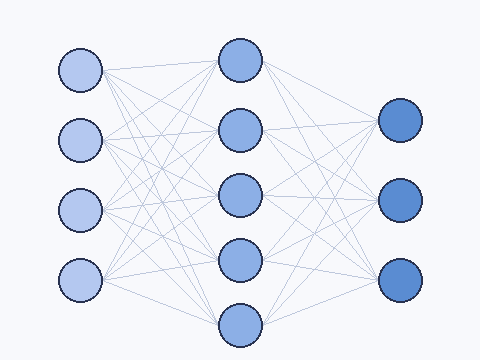

# Lookback

Local-first, multimodal semantic memory for your machine.

Index your files, code, PDFs, browser history, and **screenshots** into a
[LanceDB](https://lancedb.com) store on disk. Query by meaning from the CLI
*or* from any MCP-capable AI tool (Claude Code, Cursor, Continue, ChatGPT
Desktop, Windsurf, Zed). Everything runs on-device — no cloud, no GPU.

## See it in action

Type a description of an image. Get the image back. No captions, no
filenames, no manual tagging — MobileCLIP2-S2 embeds the query and your
screenshots into the same vision-language space, so vector similarity
just works.

<table>
<tr>
<td width="55%" valign="middle">

```
lookback search "mountains and clouds in a landscape" \
  --modality image
```

**Top hit:** `landscape.png` &nbsp;·&nbsp; score `0.671`

</td>
<td width="45%" valign="middle" align="center">

</td>
</tr>

<tr>
<td width="55%" valign="middle">

```
lookback search "a dog sitting on grass" \
  --modality image
```

**Top hit:** `dog.png` &nbsp;·&nbsp; score `0.752`

</td>
<td width="45%" valign="middle" align="center">

</td>
</tr>

<tr>
<td width="55%" valign="middle">

```
lookback search "a neural network architecture diagram" \
  --modality image
```

**Top hit:** `diagram.png` &nbsp;·&nbsp; score `0.634`

</td>
<td width="45%" valign="middle" align="center">

</td>
</tr>
</table>

> The images above are programmatically generated PIL primitives (3-10 KB
> each), not photographs — chosen so you can see *exactly* what
> MobileCLIP was given. Real screenshots produce sharper score
> separations.

For the full walkthrough (text search, hybrid FTS+vector, watcher,
`--source-kind` filters, JSON output, the MCP server), see
**[EXAMPLES.md](EXAMPLES.md)**.

## Highlights

- **Multimodal.** Real semantic search over text + screenshots in a single
  index. Cross-modal: search for *"fluffy clouds in the sky"* and you'll get
  back the screenshot, not just text mentioning clouds.
- **Local-first.** Models (Nomic Embed v1.5 + MobileCLIP2-S2) run on CPU
  via ONNX Runtime. Your data and your queries never leave your laptop.
- **MCP-native.** A single `lookback serve` makes the index available as a
  tool to every modern AI assistant. See [`MCP_SETUP.md`](MCP_SETUP.md).
- **Dev-grade DX.** Single `pip install`, sensible defaults, one config
  file, every subcommand documented.

## Status

| Milestone | Scope | State |
|---|---|---|
| M0 | Design + scaffold | ✅ |
| M1 | Lance schema + store | ✅ |
| M2 | Text embedder ABC + mock + Nomic adapter; chunking; markdown extractor; indexer | ✅ |
| M3 | Image embedder mock + screenshot extractor | ✅ |
| M4 | PDF + code extractors | ✅ |
| M5 | CLI: init / index / search / stats / models | ✅ |
| M6 | Model registry, system probe, recommendation, `init` model selection | ✅ |
| M7 | Real Nomic + MobileCLIP weights wired end-to-end, `@needs_models` smoke tests | ✅ |
| M8a | Cross-modal text→image search via MobileCLIP joint text tower; `--modality` flag | ✅ |
| M8b | File watcher (`lookback watch`); MCP server (`lookback serve`); hybrid FTS + vector (`--hybrid`); MCP setup docs | ✅ |

**194 tests, all green** (10 of them gated on real model weights; auto-skip
when absent). Run `uv sync && uv run pytest -q` to verify.

## Quick start

```bash
# Install
pip install lookback-ai    # PyPI distribution; imports as `lookback`
# OR for local development:
uv sync && uv tool install --editable .

# Bootstrap config with system-aware model recommendation
lookback init
# Detected: Darwin · arm64 · Apple Silicon · 16.0 GB RAM · 8 CPU
# Recommended: text=nomic-v1.5  image=mobileclip-s2

# Download weights (~700 MB total — Nomic v1.5 + MobileCLIP2-S2 vision + text + tokenizer)
lookback models download nomic-v1.5 mobileclip-s2

# First-time index pass over directories you care about
lookback index ~/Documents
lookback index ~/Pictures/Screenshots

# Search
lookback search "transformer attention notes"
lookback search "a diagram with red and blue arrows" --modality image
lookback search "IVF_PQ tuning" --hybrid       # FTS + vector RRF fusion

# Keep the index up to date as files change
lookback watch ~/Documents

# Expose to AI tools via MCP
lookback serve                                  # stdio (IDE-friendly)
lookback serve --transport http --port 7777     # HTTP for remote
```

See **[MCP_SETUP.md](MCP_SETUP.md)** for Claude Code / Cursor / Continue /
ChatGPT Desktop / Windsurf / Zed configuration snippets.

## Commands at a glance

| Command | What it does |
|---|---|
| `lookback init` | Detect system, recommend models, write `~/.lookback/config.toml`. Flags: `--text-model`, `--image-model`, `--interactive`. |
| `lookback models list` | Show every registered model with HF repo and disk-size estimate. |
| `lookback models download <name> [<name> …]` | Fetch weights into `models_dir`. |
| `lookback index <path>` | Walk a path, hash + skip-if-unchanged, embed new/changed files, write to Lance. |
| `lookback search <query>` | Semantic search. Flags: `--modality text|image|all`, `--source-kind <kind>`, `--hybrid`, `--limit N`, `--json`. |
| `lookback stats` | Row counts per table. |
| `lookback watch <path>` | Foreground watcher — re-indexes on FS events. |
| `lookback serve` | MCP server. `--transport stdio|http`, `--host`, `--port`. |

## Storage layout

```
~/.lookback/
├── config.toml         # one TOML, hand-editable
├── models/
│   ├── nomic-v1.5/
│   │   ├── onnx/model.onnx
│   │   └── tokenizer.json
│   └── mobileclip-s2/
│       ├── onnx/s2/vision_model.onnx
│       ├── onnx/s2/text_model.onnx
│       └── tokenizer.json
└── data/
    ├── chunks_text.lance       (Nomic 768-d)
    ├── chunks_image.lance      (MobileCLIP 512-d)
    └── files.lance             (file-level state for incremental indexing)
```

## What it indexes by default

Tier 1 (configured in `roots`, on by default):

- **Markdown / plaintext** — `.md`, `.markdown`, `.mdx`, `.txt`, `.log`, `.rst`
- **PDFs** — text-layer extraction via pypdf (OCR for image-only PDFs is M9)
- **Source code** — 40+ languages (Python, TS/JS, Go, Rust, Java, Swift, C/C++, Ruby, …) with language tags as `source_kind`
- **Screenshots** — `.png`, `.jpg`, `.webp`, `.gif`, `.bmp`. Visually searchable via MobileCLIP.

Skipped: hidden directories, `.gitignore`'d paths, `node_modules`/`.venv`/`target`/`build`/`dist`/etc., files larger than `max_file_bytes` (50 MiB default), symlinks (unless `follow_symlinks = true`).

## License

MIT
